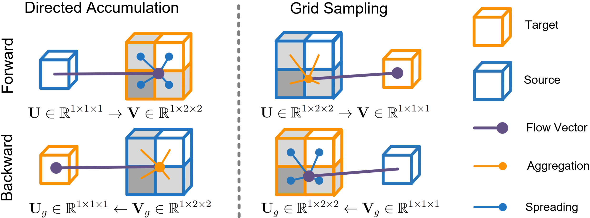

# DeDA: Differentiable Image Integration Library
 <a href="https://opensource.org/licenses/MIT"></a> 

DeDA is a general-purpose library tailored for differentiable image transformations, particularly suitable for operations involving integration or summing, such as Hough Transform, Radon Transform, and the creation of Bilateral Grids. It's designed to facilitate the development and experimentation of image processing tasks that benefit from the gradient-based learning.

## Directed Accumulator

<p align="center">
    
</p>

The Deep Directed Accumulator (DeDA) establishes a complementary relationship with grid sampling (GS), where GS "pulls" values to each cell in the target feature map from the source, whereas DeDA "pushes" values from each cell in the source to the target feature map. Essentially, GS samples, while DeDA accumulates values from the source. DeDA, as a forward function, highlights key geometric structures like lines and circles in new representations.

## Papers

**[DAGrid: Directed Accumulator Grid](https://arxiv.org/abs/2306.02589)** <br>
[Hang Zhang](https://tinymilky.com), Renjiu Hu, Xiang Chen, Rongguang Wang, Jinwei Zhang, and Jiahao . <br>
arXiv 2023. 

**[DeDA: Deep Directed Accumulator](https://link.springer.com/chapter/10.1007/978-3-031-43895-0_72)**  <br>
[Hang Zhang](https://tinymilky.com), Rongguang Wang, Renjiu Hu, Jinwei Zhang, and Jiahao Li.  <br>
MICCAI 2023.

## Todo
- [ ] Release of core CUDA/C++ implementation
- [ ] Release of a slower but more accessible version in pure Python & PyTorch
- [ ] Cross-Platform building support of CUDA/C++ implementation
- [ ] Tutorials and auxiliary code across different medical applications

## Citation
If our work has influenced or contributed to your research, please kindly acknowledge it by citing:
```
@misc{zhang2023dagrid,
      title={DAGrid: Directed Accumulator Grid}, 
      author={Hang Zhang and Renjiu Hu and Xiang Chen and Rongguang Wang and Jinwei Zhang and Jiahao Li},
      year={2023},
      eprint={2306.02589},
      archivePrefix={arXiv},
      primaryClass={cs.CV}
}

@InProceedings{10.1007/978-3-031-43895-0_72,
    author="Zhang, Hang and Wang, Rongguang and Hu, Renjiu and Zhang, Jinwei and Li, Jiahao",
    title="DeDA: Deep Directed Accumulator",
    booktitle="Medical Image Computing and Computer Assisted Intervention -- MICCAI 2023",
    year="2023",
    publisher="Springer Nature Switzerland",
    address="Cham",
    pages="765--775",
    isbn="978-3-031-43895-0"
}
```